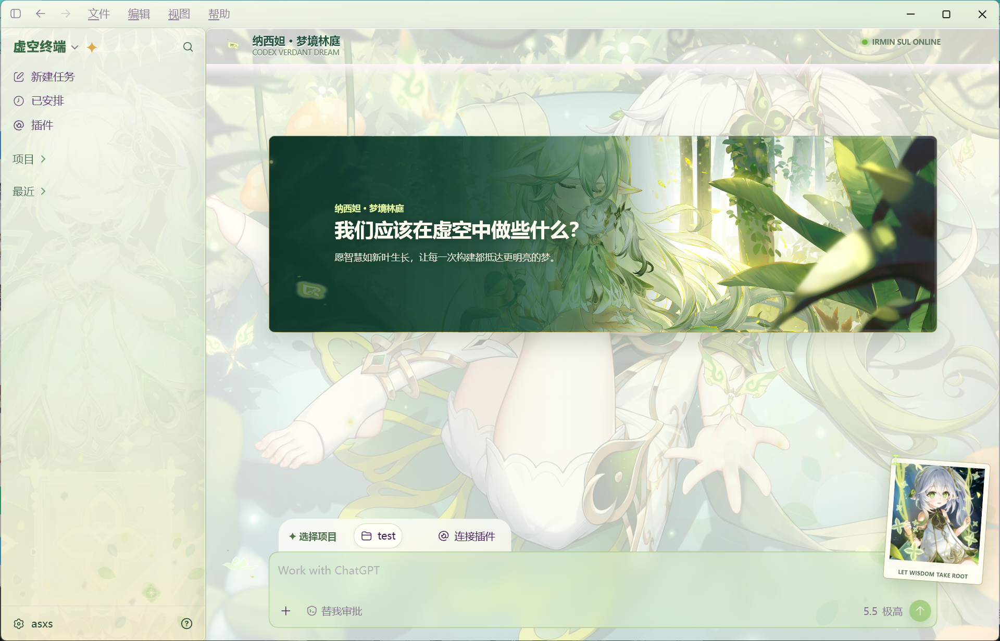
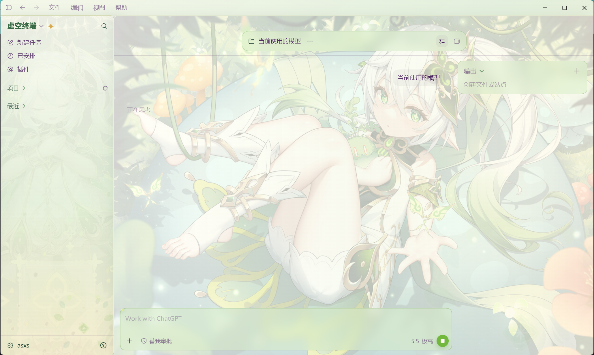
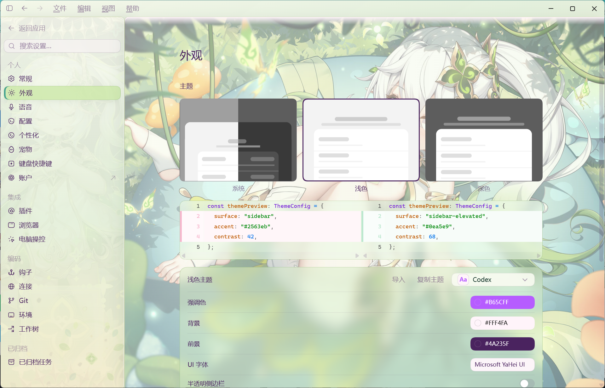

# Codex Dream Skin · Nahida

<p align="center">
  <a href="./README.md">中文</a> · <strong>English</strong>
</p>

<p align="center">
  <strong>A Nahida "Verdant Dream" theme for the Codex desktop app on Windows.</strong><br>
  Layered assets · Native controls preserved · Loopback CDP injection · Reversible by design
</p>

<p align="center">
  
</p>

> [!IMPORTANT]
> This project is Windows-only and is not an official OpenAI product. It does
> not modify WindowsApps, `app.asar`, official binaries, code signatures, API
> keys, or provider base URLs.

## Preview

Verdant Dream does not cover the application with a fake screenshot.
Background, sidebar, hero, portrait, decorations, and empty-state art are
separate layers. The Codex sidebar, project picker, task menu, settings, and
composer remain native and interactive.

<p align="center">
  <br>
  <sub>The task route reduces background distraction while preserving the output panel and composer</sub>
</p>

<p align="center">
  <br>
  <sub>Settings, appearance controls, and other native routes share the same translucent visual layer</sub>
</p>

## Features

- **Layered Nahida theme**: independent background, sidebar, hero, portrait,
  decoration atlas, and scene assets for home and task routes.
- **Native interaction**: decorative layers do not capture pointer events;
  real controls, menus, settings, and the composer remain usable.
- **Sign-in startup**: the installer can start the theme with Windows, with
  the local Nahida theme registered as the explicit default.
- **Tray management**: pause, reapply, replace the background, save/switch
  themes, import ZIP packages, and restore the official appearance.
- **Community compatibility**: supports DreamSkin.cc one-click apply and
  locally validated theme ZIP packages.
- **Controlled rollback**: startup, injection, and verification failures keep
  diagnostics and use bounded recovery without patching the official app.

## Requirements

- Windows 10 or newer, x64.
- The official `OpenAI.Codex` app installed from Microsoft Store and
  registered to the current user.
- Release installers bundle Node.js. Source checkouts require Node.js 22 or
  newer.
- Windows PowerShell 5.1 or PowerShell 7.

## Installation

### Installer

Download `CodexDreamSkin-Setup-vX.Y.Z.exe` from this repository's
[Releases](https://github.com/447662/Codex-Dream-Skin-Nahida/releases).
Close Codex, then follow the installer.

The installer is per-user and does not take ownership of WindowsApps. An
unsigned download may trigger SmartScreen; verify the repository and checksum,
then use **More info → Run anyway**. Do not disable Defender.

### From source

After cloning the repository, run this from its root:

```powershell
powershell.exe -NoProfile -ExecutionPolicy RemoteSigned `
  -File .\windows\scripts\install-dream-skin.ps1
```

Open `Codex Dream Skin` from the Start menu after installation, or launch the
local Nahida theme directly:

```powershell
powershell.exe -NoProfile -ExecutionPolicy RemoteSigned `
  -File .\windows\scripts\start-dream-skin.ps1 -UseLocalTheme -PromptRestart
```

Applying a theme may need to restart an existing Codex process. Save any
unsent input first.

## Verify and restore

After launch, verify loopback CDP ownership, native controls, and theme markers
while capturing a screenshot:

```powershell
powershell.exe -NoProfile -ExecutionPolicy RemoteSigned `
  -File .\windows\scripts\verify-dream-skin.ps1 `
  -ScreenshotPath "$env:TEMP\codex-dream-skin.png"
```

Restore the official appearance:

```powershell
powershell.exe -NoProfile -ExecutionPolicy RemoteSigned `
  -File .\windows\scripts\restore-dream-skin.ps1 `
  -RestoreBaseTheme -PromptRestart
```

Restore only handles Dream Skin-managed appearance settings and validated
sessions. It does not delete tasks, plugins, pets, accounts, or authentication
state.

## Theme switching

The `Codex Dream Skin` tray menu can:

- reapply or pause the skin;
- switch back to `Local Nahida · Verdant Dream`;
- select a clean PNG, JPEG, or WebP background;
- save the current theme or switch saved themes;
- import a constrained `.zip` theme package;
- open [DreamSkin Gallery](https://dreamskin.cc/gallery) and the
  [online Studio](https://dreamskin.cc/studio).

Do not import a preview screenshot containing windows, controls, text, or a
composer as a background. See the [Windows guide](./windows/README.en.md) for
path, image, and ZIP limits. See the
[theme replacement guide](./docs/windows-theme-replacement-guide.md) when
building your own theme.

## Repository layout

```text
Codex-Dream-Skin-Nahida/
├── windows/
│   ├── assets/       # Nahida art, CSS, renderer injection, and theme config
│   ├── scripts/      # Install, start, tray, verify, and restore
│   ├── installer/    # Windows release installer
│   ├── presets/      # Redistributable installer preset
│   ├── references/   # QA and runtime notes
│   └── tests/        # Windows regression suite
├── docs/             # Installation, customization, and README screenshots
├── LICENSE
└── NOTICE.md
```

## Development

```powershell
powershell.exe -NoProfile -ExecutionPolicy RemoteSigned `
  -File .\windows\tests\run-tests.ps1

powershell.exe -NoProfile -ExecutionPolicy RemoteSigned `
  -File .\windows\tests\installer-static.tests.ps1
```

Renderer or visual changes also require live checks on both the home and task
routes, followed by Verify, Restore, and reapply. Read the
[contribution guide](./.github/CONTRIBUTING.en.md) and
[Windows implementation constraints](./windows/SKILL.md) before contributing.

## Security boundaries

- CDP binds to `127.0.0.1` only. Do not run untrusted local software while a
  themed session is active.
- Process control requires Store package identity, executable path, port, and
  Browser ID validation.
- WindowsApps, `app.asar`, official binaries, signatures, and application
  permissions are never modified.
- API keys, base URLs, and provider settings are never written.
- `config.toml` uses strict UTF-8, atomic writes, and a recoverable backup; only
  managed appearance fields are changed.

## Origin, license, and artwork

This repository is based on the Windows implementation from
[Codex Dream Skin](https://github.com/Fei-Away/Codex-Dream-Skin), with changes
for the layered Nahida theme, sign-in startup, and local-theme switching.

Software source is released under the [MIT License](./LICENSE). Nahida,
Genshin Impact, and related character/IP artwork are outside the MIT grant.
Verify copyright, character, and trademark permissions before public,
commercial, or downstream redistribution. See [NOTICE.md](./NOTICE.md).

## Sponsor

Thanks to [Passion8](https://passion8.cc/register?aff=TuPe) for supporting the
original project. Theme installation and API configuration stay separate;
this project never rewrites model-provider settings.

---

May wisdom grow like new leaves, and every build reach a brighter dream.
